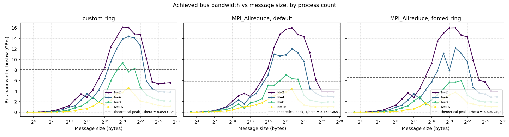

[](../../actions/workflows/ci.yml)
[](LICENSE)

# ring-allreduce

A from-scratch implementation of the ring-allreduce collective, built
directly on MPI point-to-point primitives, with no MPI collective call
anywhere inside it, benchmarked against vendor `MPI_Allreduce` and analyzed
against a fitted latency-bandwidth cost model. This repository backs three
specific claims:

> Designed and implemented a ring-allreduce collective from scratch in C++
> using MPI point-to-point communication, mirroring the core algorithm used
> in GPU communication libraries such as NCCL.

The algorithm itself is `include/ring_allreduce/ring_allreduce.hpp`, two
phases of `MPI_Isend`/`MPI_Irecv`/`MPI_Waitall` and nothing else; see
`docs/ALGORITHM.md` for the full index-arithmetic derivation and
`report/sections/02_background.tex` for the same material with a diagram.

> Benchmarked the custom implementation against `MPI_Allreduce` across
> message sizes (8B-128MB) and process counts (2-16), evaluating bus
> bandwidth efficiency and algorithmic step count.

`apps/benchmark.cpp` sweeps exactly that range against both Open MPI's
default algorithm selection and `MPI_Allreduce` forced to its own ring
algorithm; `report/sections/05_results.tex` and Table 1 in
`report/sections/02_background.tex` are where the efficiency and step-count
numbers actually land.

> Analyzed the gap between theoretical and achieved bus bandwidth using
> Python; identified pipeline fill latency and rank synchronization
> overhead as primary bottlenecks at small message sizes.

`analysis/theoretical_model.py` fits the Hockney model's alpha and beta
from measured data (weighted least squares, not an assumed constant; see
`docs/DESIGN_DECISIONS.md` for why that weighting mattered), and
`report/sections/06_discussion.tex` is where the two bottlenecks get
separated and each one quantified, not just asserted.

**Read this before citing any number from this repository:** the dataset
currently committed at `results/sample_run/` is **synthetic**, generated
from the cost model above plus noise, not measured on real hardware. It
exists so the analysis pipeline and the report could be built and reviewed
end to end in a sandbox with no MPI installation and no network access to
get one. `results/sample_run/README.md` and
`report/sections/04_experimental_setup.tex` both say so prominently, and
`docs/DESIGN_DECISIONS.md` documents exactly what could, and could not, be
verified in that environment. Running `scripts/run_local_sweep.sh` on a
machine with a working MPI installation and then `make report` replaces
every number in the report with a real one, using the identical
methodology.


*Generated from the current (synthetic, see above) sample dataset by
`analysis/generate_plots.py`. Regenerates automatically as part of `make
report` once real data exists.*

## Quickstart

```bash
git clone <this repo>
cd ring-allreduce

# Build and run the correctness suite (needs Open MPI or MPICH + CMake >= 3.16).
cmake -S . -B build -DRING_ALLREDUCE_WARNINGS_AS_ERRORS=ON
cmake --build build -j
ctest --test-dir build --output-on-failure

# Hand-runnable sanity check.
mpirun --allow-run-as-root --oversubscribe -np 8 ./build/apps/correctness_check

# Regenerate the report from the committed sample dataset (no MPI needed
# for this part, just Python + a TeX distribution): report/main.pdf in a
# few seconds.
make report
```

To run a real benchmark sweep and rebuild the report from it instead of the
synthetic sample, see `docs/BENCHMARKING.md`; the short version is
`make bench` (opt-in, actually launches `mpirun` repeatedly) followed by
`make report` again.

## Directory overview

```
include/ring_allreduce/  the algorithm: chunking, reduce ops, timer, ring_allreduce
src/                     implementations for the above
apps/                    correctness_check, benchmark, pingpong
tests/                   unit tests (chunking) and MPI correctness/edge-case tests
analysis/                Python: fits the cost model, generates figures and tables
report/                  LaTeX source for the write-up (report/main.pdf is a build output)
scripts/                 sweep drivers, MPI algorithm introspection, env setup
results/sample_run/      SYNTHETIC placeholder dataset -- read its README.md
docs/                    architecture, algorithm derivation, benchmarking, design log
```

## Reproducing the correctness tests and a real sweep

Full instructions, including how to find your Open MPI's ring algorithm ID
(it has moved across releases, do not assume it) and known gotchas around
running as root or with fewer cores than ranks, are in
`docs/BENCHMARKING.md`. `docs/ARCHITECTURE.md` and `docs/ALGORITHM.md`
cover the implementation itself, and `docs/DESIGN_DECISIONS.md` is a
running log of every judgment call made while building this, including the
sandbox constraints that shaped several of them.

## License

[MIT](LICENSE).
